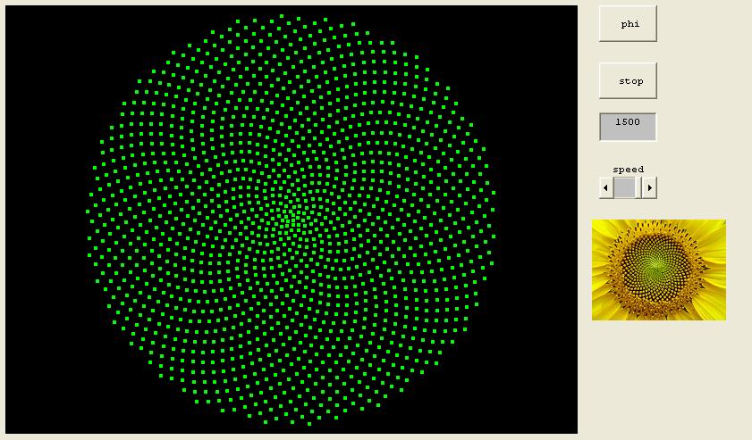



## Sunflower

### Description

Draws a sunflower using PHI (Golden Ratio - Golden Number - Fibonacci ). - Video: http://www.youtube.com/watch?v=kWiuFGCI5TU
 
### More Info
 

             |
---                |---
**Submitted On**   |2011-12-07 13:42:44
**By**             |[reexre](https://github.com/Planet-Source-Code/PSCIndex/blob/master/ByAuthor/reexre.md)
**Level**          |Intermediate
**User Rating**    |5.0 (15 globes from 3 users)
**Compatibility**  |VB 6\.0
**Category**       |[Math/ Dates](https://github.com/Planet-Source-Code/PSCIndex/blob/master/ByCategory/math-dates__1-37.md)
**World**          |[Visual Basic](https://github.com/Planet-Source-Code/PSCIndex/blob/master/ByWorld/visual-basic.md)
**Archive File**   |[Sunflower22164712122011\.zip](https://github.com/Planet-Source-Code/reexre-sunflower__1-74201/archive/master.zip)

